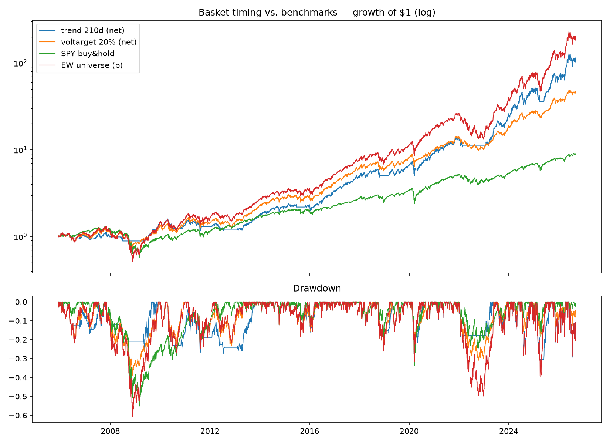

# Basket timing: trend filter and vol targeting — first survivor

**Status: walk-forward OOS section is a finding; headline tables are
in-sample and labeled as such.**

## Rationale

The universe is one dominant factor (factor note) and no cross-sectional
signal survived (robustness note) — so manage the factor. Two
pre-registered rules on the EW basket, monthly at month-end, engine
lag and costs as always:

- **Trend:** hold the basket when its index > trailing MA, else cash.
  Headline MA = 210d (the 10-month rule, chosen before running).
- **Vol target:** exposure = min(1, 20% / realized 63d vol).

## In-sample (2005 → 2026)

|                | CAGR  | Vol   | Sharpe | MaxDD  | Calmar | Turnover | Exposure |
|----------------|-------|-------|--------|--------|--------|----------|----------|
| trend 210d net | 25.5% | 24.5% | 1.05   | -31.7% | 0.81   | 1.4×/yr  | 73.5%    |
| voltarget net  | 21.1% | 20.7% | 1.03   | -38.8% | 0.54   | 0.7×/yr  | 77.0%    |
| SPY buy & hold | 11.1% | 19.2% | 0.65   | -55.2% | 0.20   | —        | —        |
| EW universe (b)| 29.1% | 30.9% | 0.98   | -60.8% | 0.48   | —        | —        |

## Surfaces (diagnostics)

Trend MA {105,147,210,252} → Sharpe {1.18, 1.10, 1.03, 0.98}: every
cell ≥ the basket, monotone toward shorter windows, no spikes.
Voltarget grid (3 targets × 2 windows) → 1.02–1.16, all cells ≥
basket; the 21d-vol-window column dominates the 63d one. Both families
are plateaus, not points. **Nothing fragile; nothing tuned.**

## Walk-forward OOS — the finding

Selection among the four trend windows (3y train / 6mo test, 37 folds,
OOS 2008-01 → 2026-07):

- **Trend walk-forward OOS net Sharpe 1.17 vs EW basket 1.03 and SPY
  0.64 over the identical window.** First strategy in this program to
  beat benchmark (b) out of sample.
- Selection is stable (ma105 chosen in 22/37 folds, never ma252 — a
  consistent preference, unlike the momentum grid's scatter).
- The edge is *risk-shaped*: the filter forfeits CAGR (25.5 vs 29.1
  in-sample) and buys a halved max drawdown (-32% vs -61%) and ~2× the
  Calmar. For a $1K Phase-1 account judged on "survivable drawdowns,"
  that is exactly the currency that matters.

**Decision:** trend-on-basket graduates to paper trading once the
broker leg exists (session 6 blocker). Vol targeting is a candidate
overlay on top of it (composition not yet tested — new hypothesis, to
be pre-registered).

## How this could be fooling us

- **Few independent events.** ~21 years contain ~4 regime exits that
  matter (2008, 2015-16, 2022, 2025 wobble). A Sharpe edge of ~0.14
  OOS built on 4 events has wide error bars; this could be luck. The
  honest claim is drawdown control, not return enhancement.
- **Trend-following's survivor halo:** like 6-1 momentum, the 10-month
  rule is the most-published timing rule in existence — collective
  prior snooping is priced into its reputation.
- **Whipsaw regime absent from sample:** a decade of sideways chop
  (1970s-style) would bleed this rule; the sample contains no such
  regime for this sector.
- **Same universe hindsight as everything else:** absolute numbers are
  inflated; the strategy-vs-(b) relative claim is the only claim.
- **Costs benign here** (1.4× turnover), so the cost-model caveats
  matter less than for the killed families — but a 2008-style spread
  blowout during exactly the exit days is not modeled.
