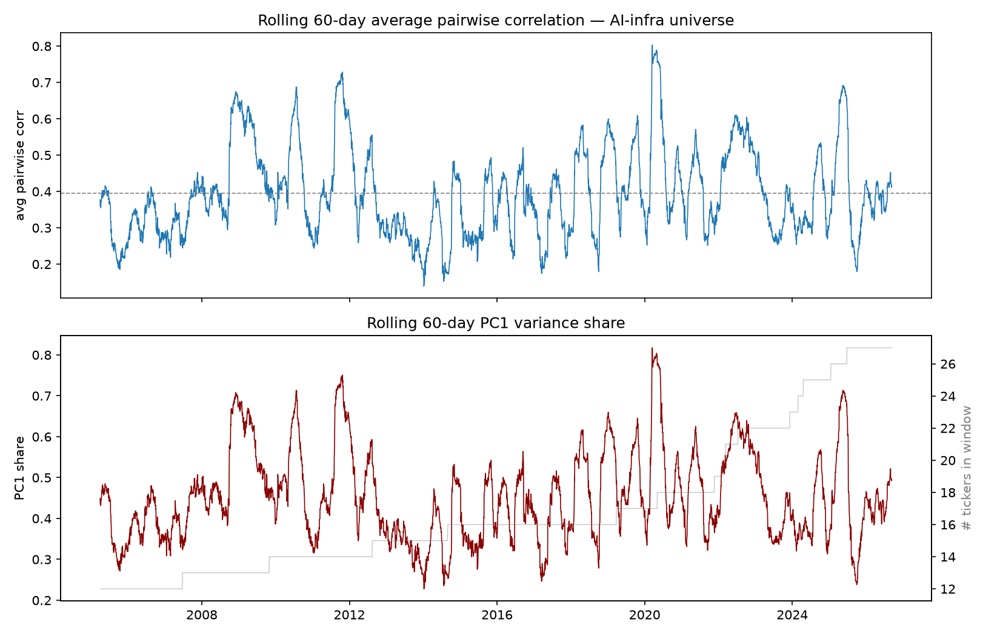
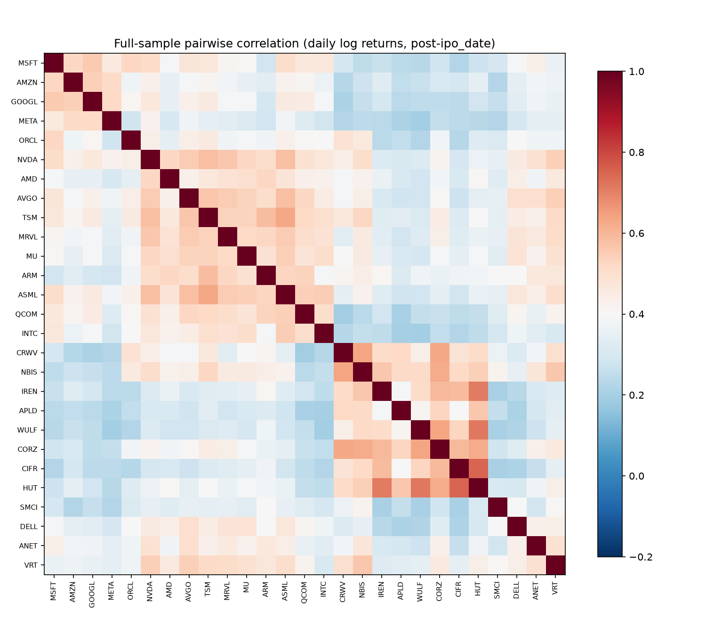

# Factor structure of the AI-infrastructure universe

**Question:** how much is this universe really one bet?

**Data:** daily log returns, adjusted closes, post-`ipo_date` only
(predecessor-entity history masked). Rolling window = 60 trading days,
only tickers with complete data in each window (5 minimum).

## Results

- Full-sample average pairwise correlation: **0.39**; PC1 explains
  **~45%** of variance on average. Last 12 months: 0.36 / 0.41.
- PC1 share ranges 0.23–0.82. It spikes above 0.7 in crisis/regime
  years (2008, 2010–11, 2020, 2025): in stress, the universe becomes
  one trade.
- Most correlated with the rest: TSM, NVDA, ASML, AVGO, NBIS — the
  semis core is the factor.
- Least correlated: SMCI, META, APLD, WULF, CIFR — idiosyncratic
  (accounting drama, ad business, miner-pivot volatility).

## Interpretation

Roughly half the daily variance is a single common factor, and in
drawdowns it is much more. Diversification *within* this universe is
limited exactly when it matters. Implications:

1. Long-only strategies on this universe are mostly a leveraged sector
   bet; benchmark (b) comparison is essential (CLAUDE.md #5).
2. Cross-sectional (relative) strategies are the honest way to add
   value here — they hedge out most of the common factor.
3. Position limits alone won't control drawdown risk; the correlation
   structure will override them in stress.

## How this could be fooling us

- **Short histories:** neoclouds have 1–4 years of data; their
  correlations are estimated mostly from a single (bullish) regime and
  will look different in a sector drawdown.
- **Window choice:** 60-day correlations are noisy; the level (0.39)
  moves with the window. The *regime pattern* is robust, the point
  estimates are not.
- **Survivorship:** the universe is names that made it to 2026 with
  >$50M/day liquidity. Failed AI-infra names are absent, which likely
  understates crisis correlation and tail risk.
- **Complete-window filter:** early windows include only large caps,
  so the early-sample factor share partly reflects a different, more
  concentrated universe.
