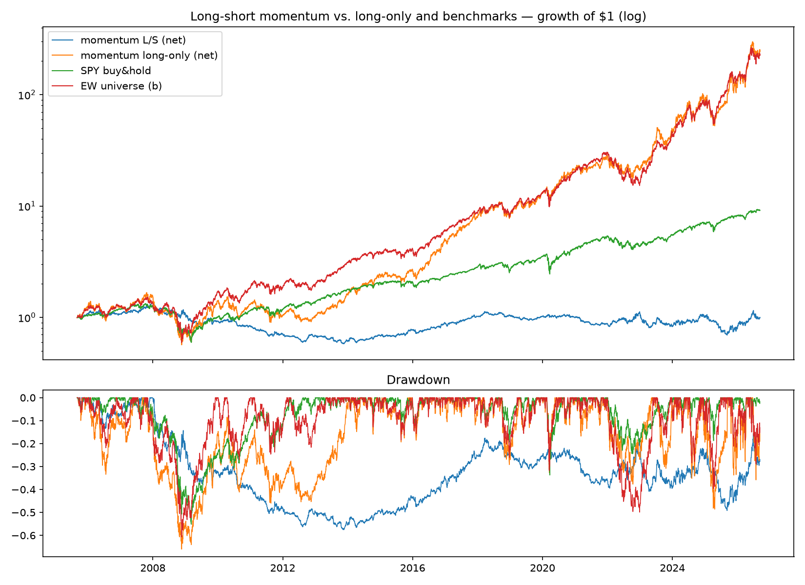

# Long-short momentum v0 — the decomposition test — IN-SAMPLE

**Status: in-sample, untuned. But the *negative* result is the point,
and it is consistent with the walk-forward note's OOS verdict.**

## Setup

Same 6-1 momentum score and month-end schedule as `momentum_xs`;
long top third (+0.5), short bottom third (−0.5), equal weight within
legs. Net 0, gross 1.0. Costs as usual; borrow fees NOT modeled — a
real short book on neocloud names would pay material borrow, so the
true result is *worse* than shown.

## Results (net, 2005-09 → 2026-09)

|                    | CAGR  | Vol   | Sharpe | MaxDD  | corr w/ EW |
|--------------------|-------|-------|--------|--------|------------|
| momentum L/S       | -0.0% | 14.4% | 0.07   | -57.6% | +0.12      |
| momentum long-only | 30.1% | 36.8% | 0.90   | -66.0% | +0.91      |
| SPY buy & hold     | 11.1% | 19.1% | 0.65   | -55.2% | —          |
| EW universe (b)    | 29.6% | 30.7% | 1.00   | -60.8% | +1.00      |

## Read — this answers the question the factor note asked

The long-short construction successfully neutralizes the factor
(corr with EW falls 0.91 → 0.12, beta 0.06). What's left after
neutralization is **nothing**: ~0% CAGR over 21 years, Sharpe 0.07,
and it still finds a way to draw down 58% (momentum-crash reversals —
the short leg rips when the factor snaps back).

Decomposition of long-only momentum on this universe:
**30.1% CAGR = sector factor (≈ benchmark b) + 0 cross-sectional alpha
− implementation drag.** The ranking signal itself carries no
information here. With 27 highly-correlated names, "relative 6-month
winners" is mostly noise ranking.

**Decision: the momentum family (long-only and L/S, monthly, price-only)
is dead on this universe.** Session 5 will sweep the parameter surface
as a final robustness check and to document the kill properly, not to
resurrect it.

What survives: the *portfolio construction machinery* (dollar-neutral
books now supported and tested), and the finding that factor
neutralization works mechanically — any future signal (PEAD variants,
pairs spreads) can be tested in both long-only and neutralized form to
separate signal from sector beta.

## How this could be fooling us

- **Small cross-section:** 5–27 names is a thin universe for
  cross-sectional ranking; academic momentum lives in 1000+ name
  universes. Absence of evidence here says little about momentum
  elsewhere — it kills the strategy *for this universe only*.
- **Borrow costs & shortability:** not modeled, and several universe
  names are hard-to-borrow small caps. This only makes the verdict
  stronger (in the same direction).
- **One construction:** equal-weight thirds at monthly frequency is a
  single point in design space; vol-weighted legs or weekly rebalance
  were not tried (and won't be, without pre-registration — noted as
  hypotheses, not rescues).
- **Regime:** a 21-year sample dominated by one secular sector bull
  run is exactly where short legs bleed; in a sideways regime the
  cross-section might matter more. No such regime exists in this data.
