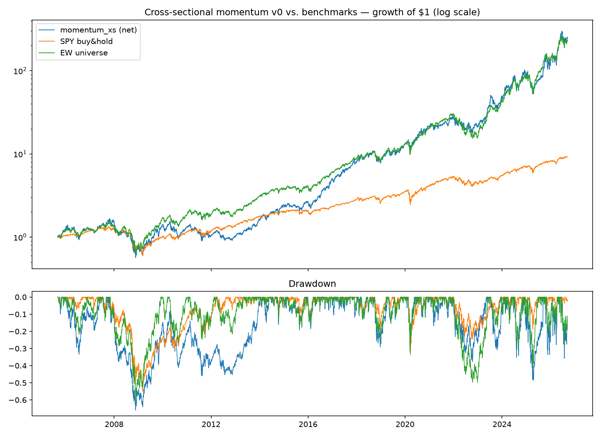

# Cross-sectional momentum v0 — IN-SAMPLE ONLY

**Status: hypothesis. This is a single untuned in-sample run, not a
finding (CLAUDE.md #6). No parameters were tuned; none may be tuned
against this sample.**

## Setup

- Universe: 27 AI-infrastructure tickers, eligible from
  `ipo_date + 60 trading days`; pre-`ipo_date` (predecessor-entity)
  data masked out.
- Signal at month-end t: trailing 126-day return ending 21 days ago
  (6-month momentum, skip the most recent month).
- Portfolio: top third by signal, equal weight, rebalanced monthly.
  Cash if fewer than 3 candidates.
- Execution: engine shifts weights one day (signal at close t, filled
  t+1); costs = 5 bps slippage + liquidity-laddered half-spread per
  side. Cost drag ≈ 0.5%/yr at ~5.7× annual one-way turnover.
- Sample: 2005-09-01 → 2026-09-11.

## Results (net of costs)

|                  | CAGR  | Vol   | Sharpe | Sortino | MaxDD  | Calmar | Hit rate | Turnover | Exposure |
|------------------|-------|-------|--------|---------|--------|--------|----------|----------|----------|
| momentum_xs net  | 30.1% | 36.8% | 0.90   | 1.31    | -66.0% | 0.46   | 54.0%    | 5.71/yr  | 96.9%    |
| momentum_xs gross| 30.8% | 36.8% | 0.91   | 1.34    | -65.8% | 0.47   | —        | —        | —        |
| SPY buy & hold   | 11.1% | 19.1% | 0.65   | 0.92    | -55.2% | 0.20   | —        | —        | —        |
| EW universe (b)  | 29.6% | 30.7% | 1.00   | 1.45    | -60.8% | 0.49   | —        | —        | —        |

## Read

Momentum crushes SPY — but so does simply owning the universe. Against
benchmark (b) the strategy has a ~0.5pt higher CAGR bought with 6pts
more vol and a deeper drawdown: **worse Sharpe, Sortino, and Calmar.
Under CLAUDE.md #5, v0 added nothing over the equal-weight basket.**
The in-sample verdict is "no edge yet," and that's before walk-forward
would get a chance to make it look worse.

Possible directions (each is a new hypothesis, to be pre-registered
before running): momentum with vol-scaling, longer/shorter lookbacks
tested as a robustness *surface* (session 5), or long-short to isolate
the cross-sectional signal from the sector factor (session 4).

## How this could be fooling us

- **Overfitting:** low risk so far — parameters are the literature
  defaults (6-1 monthly, top third) and nothing was tuned. This
  protection evaporates the moment we start iterating; keep a count of
  every variant ever run against this sample.
- **Lookahead:** signal uses `shift(21)`/`shift(147)` and the engine
  adds a one-day execution lag; `tests/test_no_lookahead.py` asserts a
  clairvoyant weight earns nothing same-day. Residual risk: yfinance
  *adjusted* closes bake in later splits/dividends — fine for returns,
  but a subtle leak if we ever filter on price levels.
- **Survivorship:** the universe was chosen in 2026 from names that
  survived and stayed liquid — an in-sample screen by construction.
  The 20-year backtest inherits it: AI-infra losers (and delistings
  like the original Core Scientific listing) are absent. Both the
  strategy AND benchmark (b) benefit, which is why (b) is the bar.
- **Data snooping:** the universe itself encodes 2026 hindsight
  ("AI infrastructure" was not a 2005 category). The absolute numbers
  are inflated; only strategy-vs-(b) relative statements carry
  information, and even those are conditional on the theme working.
- **Regime dependence:** the sample is dominated by two mega bull runs
  (2009–2021, 2023–2026) in this exact sector. Momentum's known
  failure mode — sharp reversals (2008, Mar 2020, 2022) — shows up as
  the -66% drawdown. A regime where the AI theme breaks has no
  precedent in this data.
- **Cost model optimism:** half-spread ladder is a guess from today's
  liquidity; 2005-era spreads (and neocloud spreads in stress) were
  wider. At 5.7× turnover a 10 bps error ≈ 0.6%/yr.
