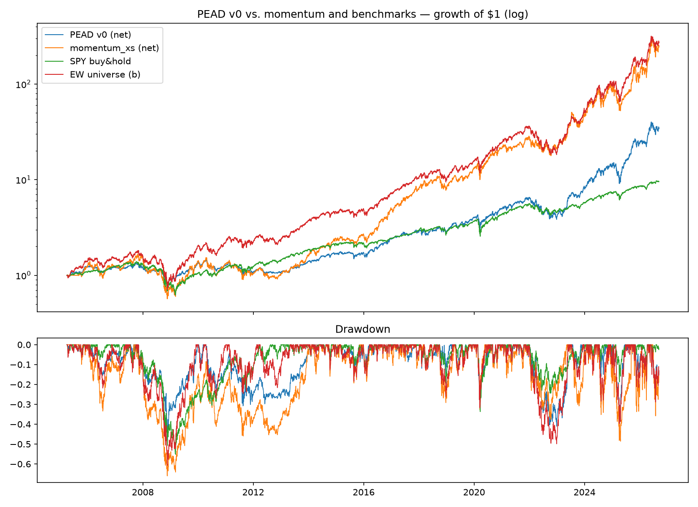

# Post-earnings-announcement drift v0 — IN-SAMPLE ONLY

**Status: hypothesis (single untuned in-sample run).**

## Data

yfinance earnings dates + EPS surprises, cached under
`data/cache/earnings/`. Coverage is good: 1,592 reported quarters,
1,585 with a surprise figure; mature names reach back to 2000–2007
(full table: `figures/earnings-coverage.csv`). Caveats: NBIS's pre-2024
events are Yandex-era — they can't trade because eligibility starts at
the 2024 relisting, but they sit in the events table; ~79% of all
surprises are positive (analyst estimates lowball systematically), so
"positive surprise" is a weak filter by construction.

## Rule (pre-registered, untuned)

Long any eligible name whose latest report beat estimates
(surprise ≥ 0). Enter at the close of the first trading day after the
announcement (engine adds one more day of lag — the day-one gap is
deliberately not traded). Hold 42 trading days, truncated at the next
print. Equal weight, 10% per-name cap, remainder in cash.

## Results (net, 2005-04 → 2026-09)

|                | CAGR  | Vol   | Sharpe | Sortino | MaxDD  | Calmar | Turnover | Exposure |
|----------------|-------|-------|--------|---------|--------|--------|----------|----------|
| PEAD v0 net    | 18.0% | 24.4% | 0.80   | 1.16    | -48.1% | 0.38   | 11.7×/yr | 75.4%    |
| PEAD v0 gross  | 19.3% | 24.4% | 0.85   | 1.22    | -47.7% | 0.40   | —        | —        |
| SPY buy & hold | 11.1% | 19.0% | 0.65   | 0.92    | -55.2% | 0.20   | —        | —        |
| EW universe (b)| 30.0% | 30.5% | 1.01   | 1.47    | -60.8% | 0.49   | —        | —        |
| momentum_xs net| 29.5% | 36.4% | 0.89   | 1.30    | -66.0% | 0.45   | —        | —        |

## Read

Same verdict as momentum: beats SPY, loses to benchmark (b)
risk-adjusted. Two things are still interesting:

1. **Risk profile differs.** PEAD runs at 24% vol with the shallowest
   max drawdown in the table (-48%) and only ~75% average exposure —
   the ~25% cash sleeve is doing real work in drawdowns. Its return
   *stream* is a different shape than momentum's, which matters for
   combining strategies later.
2. **Cost sensitivity.** At 11.7× turnover, costs eat 1.3%/yr — double
   momentum's drag. Any refinement must justify its turnover.

Next hypotheses for this family (pre-register before running):
surprise-magnitude threshold or cross-sectional top-N by surprise
(fixes the weak-filter problem), shorter holds, drift-vs-reversal split
by market-cap bucket, and a momentum+PEAD combined portfolio.

## How this could be fooling us

- **Lookahead via announcement timing:** surprise data carries no
  before/after-close flag; the extra full-day lag protects against it
  but also discards the strongest drift day — biased conservative,
  which is survivable.
- **Estimate revisions:** yfinance shows the *final* consensus
  estimate. If estimates were revised after earlier data pulls, the
  surprise we compute isn't the surprise a live trader saw
  (point-in-time estimates need a paid source).
- **Survivorship / hindsight universe:** as always — plus an extra
  twist: names with catastrophic earnings misses tend to leave
  universes like this one, flattering a "buy the beat" rule.
- **Regime dependence:** drift is strongest in the small/mid-cap names
  whose histories here are short and bull-market-only.
- **Data vendor quality:** yfinance surprises are unaudited; a few
  extreme surprise values were not hand-checked against filings.
