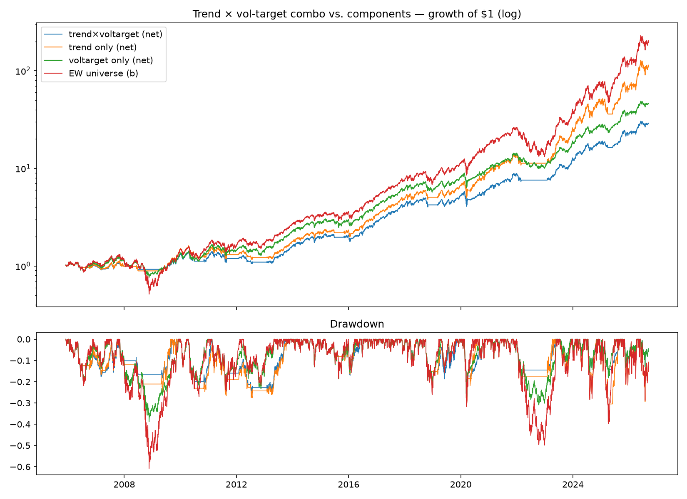

# Portfolio assembly — combo test and Phase-1 implementation — IN-SAMPLE

## Combo hypothesis (pre-registered): trend × vol-target

Exposure = trend_signal(210d) × min(1, 20% / realized 63d vol): cash in
downtrends, vol-scaled in uptrends.

|                 | CAGR  | Vol   | Sharpe | MaxDD  | Calmar | Exposure |
|-----------------|-------|-------|--------|--------|--------|----------|
| trend × voltarget | 17.6% | 18.2% | 0.98 | -29.0% | 0.61   | 60.8%    |
| trend only      | 25.5% | 24.5% | 1.05   | -31.7% | 0.81   | 73.5%    |
| voltarget only  | 20.3% | 20.8% | 0.99   | -38.8% | 0.52   | 77.0%    |
| SPY buy & hold  | 11.1% | 19.2% | 0.65   | -55.2% | 0.20   | —        |
| EW universe (b) | 29.1% | 30.9% | 0.98   | -60.8% | 0.48   | —        |

**Verdict: combo rejected.** The two signals de-risk the same episodes
(high vol and broken trend coincide in this universe — see the factor
note's PC1 spikes), so stacking them double-counts the hedge: drawdown
improves 3 points over trend-only while Sharpe and Calmar get worse.
**Trend-only remains the core sleeve.** No further overlay variants
will be tried against this sample (each attempt is another snoop).

## Phase-1 implementation reality check ($1K, whole shares?)

At current prices, equal-weighting 27 eligible names gives $37/name —
but the median universe share price is ~$225 (ASML ~$1,698). Only 4
names (APLD, WULF, CORZ, CIFR — the cheapest, most volatile ones) are
affordable at one whole share. **A whole-share $1K implementation of
this strategy does not exist**; forcing one would concentrate the
account in exactly the junkiest corner of the universe.

Implications for the blocked broker decision (plan.md):
- **Fractional shares are a hard requirement → Alpaca** (full
  fractional support, clean paper-trading API). Schwab's fractional
  program (S&P 500 slices) does not cover ~half this universe.
- Alternative worth pricing out: hold SMH as the basket proxy for the
  trend signal (1 ticker, no fractional problem) and accept tracking
  error vs. the custom universe — the trend rule's value came from the
  timing, not the exact basket.

## How this could be fooling us

- The combo was one pre-registered try; its rejection is clean. But
  the *reason* (hedge double-counting) is an in-sample observation —
  in a regime where vol spikes without trend breaks (grinding chop),
  the overlay could earn its keep. Not testable in this sample.
- The whole-share analysis uses today's prices; splits change the
  arithmetic but not the conclusion's direction.
- SMH-proxy idea is untested here — it's a hypothesis for session 10,
  not a result.
