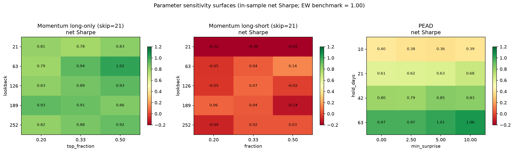

# Parameter robustness surfaces — momentum (LO/LS) and PEAD

**Protocol:** full-sample net Sharpe over a pre-registered neighborhood
of each strategy's defaults. Surfaces are *diagnostics*: a plateau
means the earlier conclusions weren't a lucky parameter pick; the max
of a surface is never promoted to a parameter choice. In-sample by
construction — used only to characterize fragility, not to report
performance. Reference: EW universe benchmark Sharpe = 1.00.

Grids: momentum lookback {21,63,126,189,252} × skip {0,21} × fraction
{0.2, 1/3, 0.5} (30 cells each for long-only and long-short); PEAD
hold {10,21,42,63} × min surprise {0, 2.5, 5, 10} (16 cells). 76
backtests, all through the same engine and cost model.

Raw grids: `figures/robustness-{mom-lo,mom-ls,pead}.csv`.

## Momentum long-only: robustly mediocre

Sharpe range 0.78–1.02, median 0.92, IQR 0.07. The surface is a flat
plateau sitting *below* the benchmark's 1.00 — the single best cell of
30 barely touches it. The walk-forward verdict ("adds nothing") is not
parameter-sensitive. **Kill confirmed.**

## Momentum long-short: robustly zero

Sharpe range −0.42 to +0.19, median 0.03; only 63% of cells are even
positive. No lookback, skip, or leg width finds a cross-sectional
signal. The decomposition note's conclusion (zero alpha net of the
factor) holds across the whole neighborhood. **Kill confirmed.**

## PEAD: the gradient is the tell

| hold \ min_surprise | 0.0 | 2.5 | 5.0 | 10.0 |
|---|---|---|---|---|
| 10d | 0.40 | 0.38 | 0.36 | 0.39 |
| 21d | 0.61 | 0.62 | 0.63 | 0.68 |
| 42d | 0.80 | 0.79 | 0.85 | 0.83 |
| 63d | 0.97 | 0.97 | 1.01 | 1.06 |

Two clean facts: Sharpe is **monotone in hold length** and **flat in
the surprise threshold**. Both point the same way: the "drift" isn't
drift. If post-earnings drift were the driver, *short* holds (the
concentrated drift window) would be best and the surprise filter would
matter. Instead, at 63-day holds — with quarterly prints ~63 trading
days apart — the book converges to "own almost everything that didn't
miss," i.e. a noisy copy of the EW basket, and lands exactly at the
basket's Sharpe (~1.0). The earnings signal contributes ≈ nothing.
**PEAD as implemented is sector beta in a costume; killed as an alpha
source.** (Its lower-vol, higher-cash risk *shape* remains noted as a
possible portfolio-construction tool, not a signal.)

## Where this leaves the program

Every long-only tilt tested converges to or under benchmark (b), and
the only neutralized book is zero. This is the expected outcome for
price-and-consensus-derived signals on 27 correlated names — and the
methodology caught it cheaply. Honest paths forward, in order of
promise: (1) strategies that manage the *factor itself* (time-series /
regime signals on the basket, vol targeting), (2) pairs/spread trades
on economically-linked subsets, (3) signals from data the crowd isn't
pricing (none currently available in this stack).

## How this could be fooling us

- **76 backtests were run on one sample.** The surfaces themselves are
  now snooped; any future "discovery" inside these grids is worthless.
  The snoop ledger for this dataset stands at ~9 (walk-forward grid)
  + 76 + 3 originals.
- **Full-sample Sharpe** hides regime variation; a cell could be flat
  overall but strong in half the sample. Not explored, deliberately.
- **Negative results are regime-conditional too:** one secular bull
  sector, survivorship-curated. A momentum signal could exist in a
  future regime this data doesn't contain.
