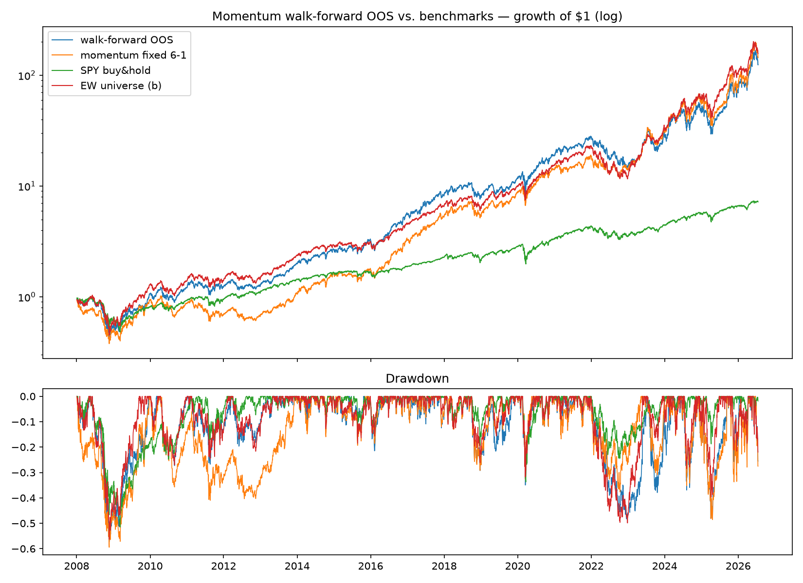

# Walk-forward validation of cross-sectional momentum — FINDING

Unlike the v0 note (in-sample), this is out-of-sample and may be
treated as a finding under CLAUDE.md #6.

## Protocol (pre-registered before any run)

- Grid: lookback {63, 126, 252} × top fraction {1/4, 1/3, 1/2},
  skip = 21 fixed. 9 candidates, all long-only monthly momentum.
- Rolling folds: train 756 trading days (3y), test 126 (6mo), step 126.
  37 folds, OOS spans 2008-01 → 2026-07.
- Selection metric: net Sharpe on the train window only. The stitched
  test-window returns of each fold's winner form the OOS series.
- Costs and one-day execution lag as in the engine; fold-boundary
  parameter-switch turnover not charged (quarterly-scale, small).

## Results (net)

|                        | CAGR  | Vol   | Sharpe | Sortino | MaxDD  | Calmar |
|------------------------|-------|-------|--------|---------|--------|--------|
| momentum walk-forward OOS | 29.8% | 36.2% | 0.90 | 1.31 | -57.2% | 0.52 |
| momentum fixed 6-1 (ref)  | 30.8% | 37.2% | 0.91 | 1.32 | -59.5% | 0.52 |
| SPY buy & hold            | 11.3% | 19.8% | 0.64 | 0.90 | -51.5% | 0.22 |
| EW universe (b)           | 31.4% | 31.5% | 1.03 | 1.48 | -56.3% | 0.56 |

Fold-by-fold log: `figures/walkforward-momentum-folds.csv`.

## Findings

1. **Long-only cross-sectional momentum on this universe adds nothing
   over the equal-weight basket, out of sample.** OOS Sharpe 0.90 vs
   1.03, worse Sortino and Calmar, more vol. Same verdict as in-sample,
   now with the right to state it.
2. **Parameter selection adds nothing either.** Walk-forward selection
   (Sharpe 0.90) ties the untuned fixed 6-1 reference (0.91). Chosen
   params scatter across 8 of 9 grid cells with no persistence —
   train-window Sharpe differences between momentum flavors are mostly
   noise. This pre-empts session 5: the long-only momentum surface is
   flat-to-fragile; there is no point tuning it.
3. Momentum's relative losses concentrate in reversal years — consistent
   with the factor note: when PC1 spikes, cross-sectional ranking has
   nothing to rank.

**Decision:** stop iterating on long-only momentum. Next hypotheses:
long-short momentum (session 4) to actually use the cross-section, and
PEAD (session 3) as an orthogonal signal family.

## How this could be fooling us

- **Grid snooping:** the grid was registered before running, but it was
  *chosen* by someone who has read the momentum literature — the 6-1
  default is itself the survivor of decades of collective data mining.
- **Selection metric:** Sharpe-on-train is one choice; ranking folds by
  Sortino or Calmar could pick different winners. Untested by design
  (each extra metric is another snooping degree of freedom).
- **Survivorship & hindsight universe:** unchanged from the v0 note —
  both strategy and benchmark (b) are inflated; only the relative
  statement is meaningful.
- **Fold structure:** 6-month test windows with a 3y train are one of
  many reasonable splits. The tie between selected and fixed params
  suggests results are not sensitive to this, but it was not swept.
- **Costs:** parameter-switch turnover at fold boundaries is uncharged;
  at ~2 switches/year and <100% turnover each, drag < 0.1%/yr — not
  enough to change the verdict.
