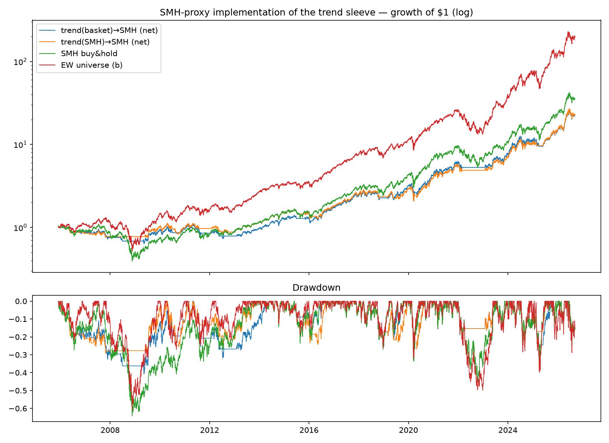

# SMH as the Schwab-implementable proxy for the trend sleeve — IN-SAMPLE

**Context:** broker decision is Schwab. Schwab has no fractional shares
outside S&P 500 Stock Slices and no paper-trading API sandbox. At $1K,
the validated trend-on-basket sleeve is not directly tradable there
(see 2026-09-12-portfolio-assembly.md), so the implementable expression
is the trend signal applied to whole shares of SMH.

## Test

Same 210d trend signal computed on the EW basket (the validated
signal), P&L from holding SMH instead of the basket. Robustness
variant: signal computed on SMH itself (92% signal agreement).

## Results (net, 2005-12 → 2026-09)

|                     | CAGR  | Vol   | Sharpe | MaxDD  | Calmar |
|---------------------|-------|-------|--------|--------|--------|
| trend(basket) → SMH | 16.2% | 23.9% | 0.75   | -40.7% | 0.40   |
| trend(SMH) → SMH    | 16.3% | 23.2% | 0.77   | -33.6% | 0.49   |
| SMH buy & hold      | 18.8% | 30.3% | 0.72   | -64.2% | 0.29   |
| SPY buy & hold      | 11.1% | 19.2% | 0.65   | -55.2% | 0.20   |
| EW universe (b)     | 29.1% | 30.9% | 0.98   | -60.8% | 0.48   |
| *(reference: trend → basket)* | *25.5%* | *24.5%* | *1.05* | *-31.7%* | *0.81* |

## Read — the proxy is honest but expensive

The "timing is the value, basket doesn't matter" hypothesis from the
assembly note is **rejected**: swapping the basket for SMH costs ~9
points of CAGR and drops Sharpe from 1.05 to 0.75. The basket's edge
was substantially the *holdings* (equal-weighted non-semi names —
hyperscalers, neoclouds, power/hardware), which SMH's cap-weighted
pure-semi book doesn't carry.

What the proxy still delivers: better Sharpe and vastly better Calmar
than buy-and-hold SMH (0.40 vs 0.29, max DD -41% vs -64%), and it
beats SPY on everything. As a $1K Phase-1 *process vehicle* — whose
stated goal is journaled discipline, not returns — it is adequate.
Note the self-referential variant (signal on SMH itself) is at least
as good and operationally simpler; flagged, not adopted (that choice
should be pre-registered if it matters later).

**Decision:** paper-trade BOTH books in the internal simulator —
`paper/basket` (fractional, strategy-faithful) and `paper/smh` (whole
shares, Schwab-implementable). The Phase-2 gate review compares them
with real forward data and decides whether Phase 2 capital (a sliver
of the main portfolio, likely enough for whole-share basket ≈ $45K+)
goes to the real sleeve.

## How this could be fooling us

- In-sample comparison; the 9-point gap is dominated by the same
  survivor/hindsight-flattered basket composition flagged in every
  note. The *forward* paper race between the two books is the honest
  test and starts now.
- SMH's own history embeds semi-sector survivorship (index
  reconstitution) — its buy-and-hold row is flattered too.
- Whole-share lumpiness (~$570/share ≈ 57% granularity at $1K NAV) is
  modeled in the simulator but not in this backtest.
